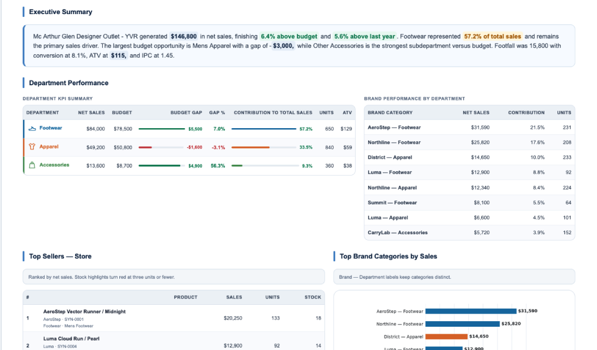
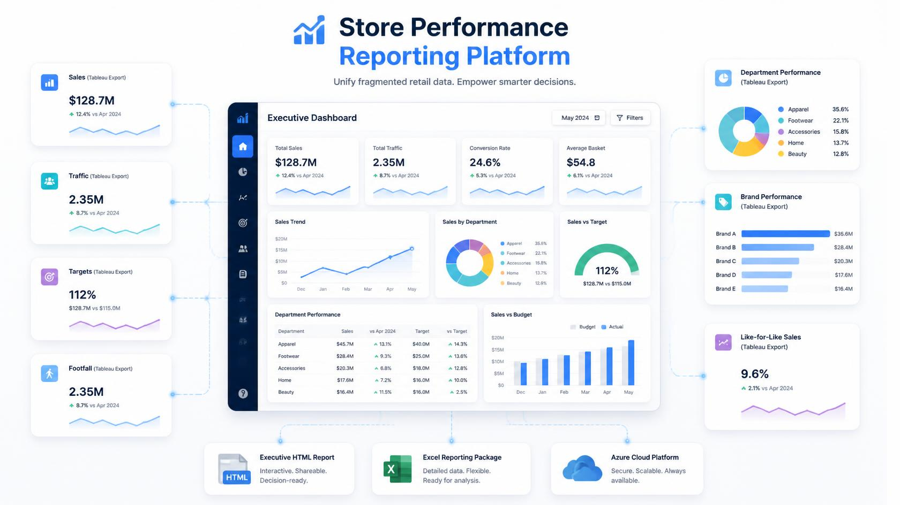
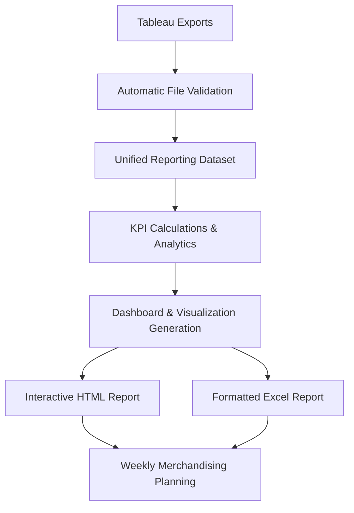
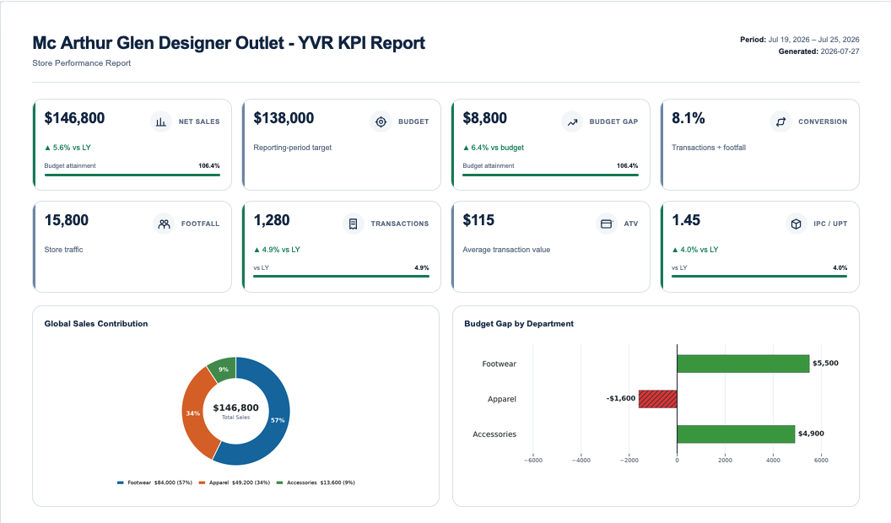
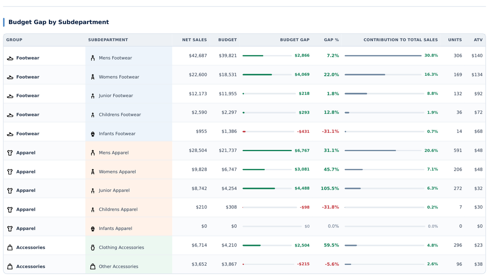
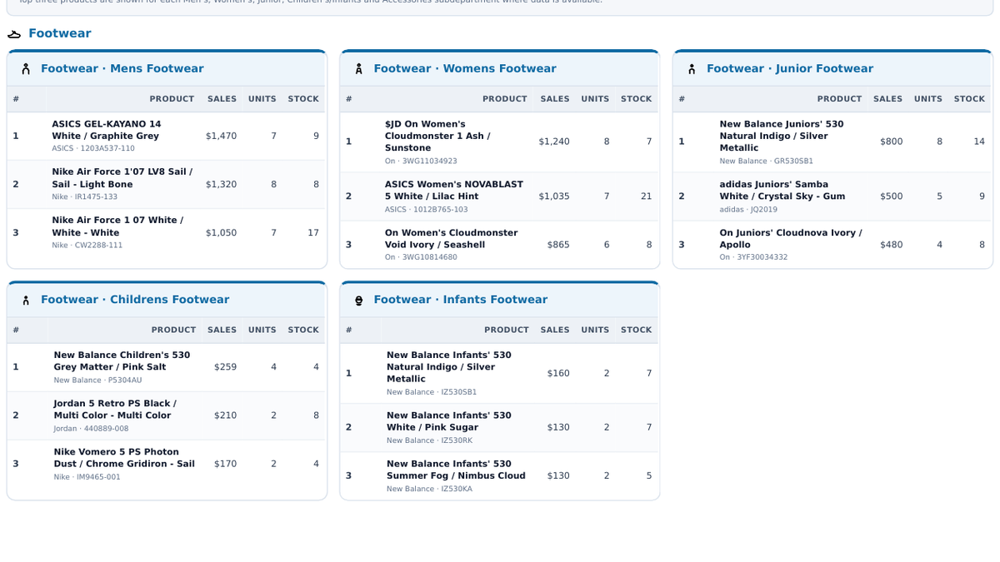

# Store Performance Reporting Platform

### Executive Retail Analytics & Decision Support

> Transforming raw Tableau exports into executive-ready retail performance intelligence.




The **Store Performance Reporting Platform** transforms multiple Tableau exports into executive dashboards, interactive HTML reports, and formatted Excel reporting packages, allowing retail managers and Visual Merchandisers to spend less time preparing reports and more time making merchandising decisions.

---

## Quick Links

**Live Application**  
https://retail-performance-reporting.streamlit.app/

**Portfolio Case Study** *(Coming Soon)*

---

## Business Impact

- ⏱ **Report Preparation:** 45 minutes → ~5 minutes
- 📈 **Time Reduction:** ≈89%
- 📊 **Data Sources:** Multiple Tableau exports
- 📄 **Deliverables:** Interactive HTML & Excel reports
- ✅ **Status:** Active Production

---

# Executive Summary

The **Store Performance Reporting Platform** was created to solve a problem I experienced every Monday as a **Visual Merchandising Manager**.

Before planning the week's merchandising priorities, I first had to prepare a performance report by downloading multiple Tableau exports, validating datasets, consolidating information, calculating KPIs, formatting dashboards, and summarizing results for store leadership.

Preparing the report took approximately **45 minutes**, but the report itself wasn't the goal.

The goal was making better merchandising decisions.

I developed this platform to eliminate repetitive report preparation so that both I—and eventually other Visual Merchandisers—could spend more time analyzing store performance and less time assembling data.

Today the same process takes approximately **5 minutes**, producing standardized executive reports ready for weekly planning and leadership discussions.

---

# The Challenge

Weekly retail reporting is essential for planning merchandising priorities, communicating store performance to leadership, and identifying departments requiring attention.

However, preparing those reports manually required:

- Downloading multiple Tableau exports
- Validating every dataset
- Consolidating information
- Calculating KPIs
- Formatting executive dashboards
- Writing performance summaries

Although these activities were necessary, they delayed the most valuable part of the process:

**Understanding store performance and deciding what actions to take.**

---

# The Solution

The platform transforms a repetitive reporting workflow into an automated analytics pipeline.

Instead of manually preparing reports, users simply upload the required Tableau exports while the application automatically:

- Identifies and validates every file
- Builds a unified reporting dataset
- Calculates operational KPIs
- Generates executive dashboards
- Produces interactive HTML reports
- Exports formatted Excel reports

The result is a standardized reporting workflow that consistently delivers decision-ready insights in minutes.



---

### Results

- Reduced weekly report preparation from **approximately 45 minutes to around 5 minutes** (≈89% reduction)
- Standardized KPI calculations and reporting across stores
- Improved consistency of executive reports
- Reduced manual data preparation
- Increased time available for merchandising planning
- Improved communication with store leadership
- Better operational decision support

---

# Workflow



From raw operational data to weekly merchandising planning, every stage of the reporting process is automated to improve consistency, reduce preparation time, and support better business decisions.

---

# Executive Dashboard

The executive dashboard provides an immediate overview of sales performance, budget attainment, conversion, traffic, and operational KPIs, allowing managers to quickly assess overall store performance.



---

# Executive Summary

Automatically generated executive summaries highlight the week's most significant operational insights, making it easier to communicate store performance with leadership.


---

# Department Performance

Detailed department analysis highlights sales performance, budget attainment, contribution, and operational KPIs, helping managers identify priorities for the upcoming week.



---

# Brand & Product Insights

Top-performing brands and products are automatically identified, providing valuable merchandising intelligence to support assortment decisions and execution priorities.



---

# Key Capabilities

- Automatic Tableau export validation
- Guided upload workflow
- Unified reporting data model
- Executive KPI dashboard
- Department performance analytics
- Budget performance monitoring
- Sales mix visualization
- Brand performance analysis
- Interactive HTML reporting
- Formatted Excel report generation

---

# Technology Stack

| Layer | Technologies |
|--------|--------------|
| **Backend** | Python |
| **User Interface** | Streamlit |
| **Data Processing** | Pandas · NumPy |
| **Visualization** | Matplotlib |
| **Reporting** | HTML · OpenPyXL · XlsxWriter |

---

# Repository Structure

```text
📁 app.py
   Main Streamlit application

📁 upload_classifier.py
   Upload validation and automatic file identification

📁 vm_report_data_model_v2.py
   Unified reporting data model

📁 report_calculations.py
   KPI calculations and analytics

📁 chart_builder.py
   Dashboard visualizations

📁 html_report_builder.py
   HTML report generation

📁 report_generator.py
   Coordinates the reporting workflow
```

---

# Roadmap

## Next Release

- Enhanced PDF publishing
- Historical trend analysis
- Interactive report filtering
- Performance optimization

## Future Vision

- District performance comparisons
- Multi-store analytics
- Scheduled report generation
- Cloud deployment
- Configurable KPI templates

---

# About the Author

**Diego Díaz Iturbe**

**Data Analytics • Automation • Cloud • GIS**

I enjoy solving operational problems by combining data analytics, automation, and visualization into practical decision-support systems.

**Portfolio**  
https://impactomex.wixsite.com/eportfolio

**LinkedIn**  
https://www.linkedin.com/in/diaziturbe
