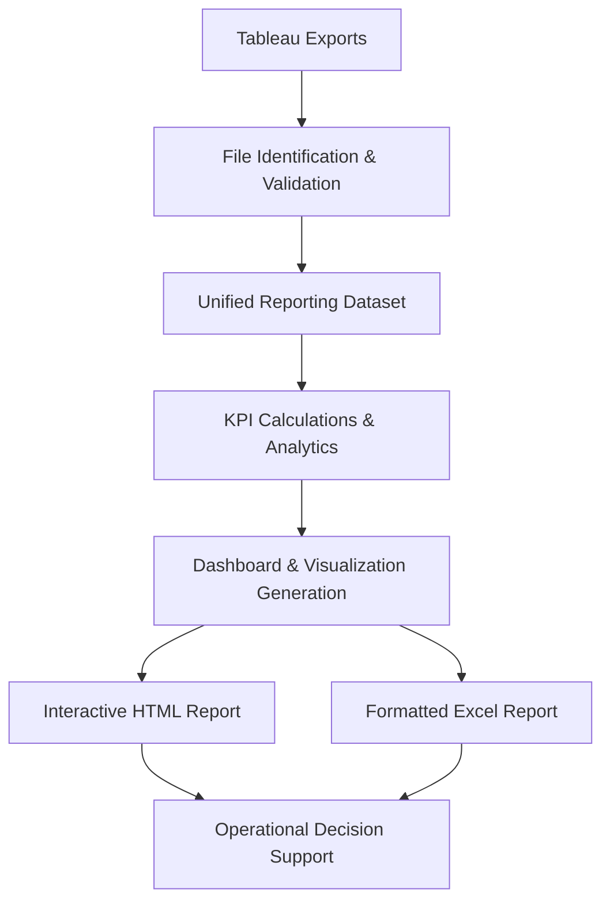

# Store Performance Reporting Platform

### Executive Retail Analytics & Decision Support

> Transforming raw Tableau exports into executive-ready retail performance intelligence.


The **Store Performance Reporting Platform** automates the transformation of multiple Tableau exports into standardized executive dashboards, interactive HTML reports, and formatted Excel reporting packages, enabling managers to spend less time preparing reports and more time making informed business decisions.

---

## Quick Links

**Live Application**  
https://retail-performance-reporting.streamlit.app/

**Portfolio Case Study** *(Coming Soon)*

---

# Executive Summary

The Store Performance Reporting Platform is an end-to-end retail analytics solution that transforms raw operational data into executive-ready performance reports.

Developed to eliminate repetitive reporting work, the platform automates data validation, KPI calculations, visualization, and report generation, allowing managers to focus on interpreting results rather than preparing reports.

The result is a standardized reporting workflow that delivers consistent, accurate, and decision-ready business insights in minutes.

---

# The Challenge

Every reporting cycle requires managers to download multiple Tableau exports, validate each dataset, consolidate information, calculate KPIs, format reports, and prepare executive summaries.

This repetitive workflow consumes valuable management time, increases the risk of manual errors, and makes it difficult to maintain consistent reporting standards across reporting periods.

---

# The Solution

The platform transforms a traditionally manual reporting workflow into an automated analytics pipeline that validates incoming data, consolidates multiple Tableau exports into a unified reporting model, calculates key business metrics, and produces executive-ready dashboards and reports.

---

# Workflow



From raw operational data to executive decision support, every stage of the reporting process is automated to improve consistency, reduce manual effort, and deliver reliable business insights in minutes.

---

# Executive Dashboard

Provides executives with an immediate overview of sales performance, budget attainment, traffic, conversion, and operational KPIs.


---

# Executive Summary

Automatically generated narrative highlighting the week's most significant operational insights and performance trends.


---

# Department Analysis

Enables managers to identify high-performing departments, budget gaps, and operational opportunities through detailed KPI analysis.


---

# Product & Brand Performance

Supports merchandising decisions by automatically identifying the highest-performing brands and products across departments and subdepartments.


---

# Business Impact

The Store Performance Reporting Platform replaces a repetitive manual reporting workflow with a standardized analytics pipeline that delivers consistent, executive-ready insights.

### Benefits

- Reduced report preparation time
- Standardized KPI calculations
- Improved reporting consistency
- Executive-ready dashboards
- Better operational decision support
- Reduced manual reporting effort

---

# Key Capabilities

- Automated Tableau export validation
- Guided upload workflow
- Unified reporting data model
- Executive KPI dashboard
- Department performance analysis
- Budget performance monitoring
- Sales mix visualization
- Brand performance analytics
- Interactive HTML reporting
- Formatted Excel report generation

---

# Technology Stack

| Layer | Technologies |
|--------|--------------|
| **Backend** | Python |
| **User Interface** | Streamlit |
| **Data Processing** | Pandas · NumPy |
| **Visualization** | Matplotlib |
| **Reporting** | HTML · OpenPyXL · XlsxWriter |

---

# Repository Structure

```text
📁 app.py
   Main Streamlit application

📁 upload_classifier.py
   Upload validation and file identification

📁 vm_report_data_model_v2.py
   Data model construction

📁 report_calculations.py
   KPI calculations

📁 chart_builder.py
   Chart generation

📁 html_report_builder.py
   HTML report generation

📁 report_generator.py
   Coordinates the reporting pipeline
```

---

# Roadmap

## Next Release

- Enhanced PDF publishing
- Historical trend analysis
- Interactive report filtering
- Performance optimization

## Future Vision

- District performance comparisons
- Multi-store analytics
- Scheduled report generation
- Cloud deployment
- Configurable KPI templates

---

# About the Author

**Diego Díaz Iturbe**

**Data Analytics • Automation • Cloud • GIS**

Building practical decision-support systems through analytics, automation, and visualization.

**Portfolio**  
https://impactomex.wixsite.com/eportfolio

**LinkedIn**  
https://www.linkedin.com/in/diaziturbe
